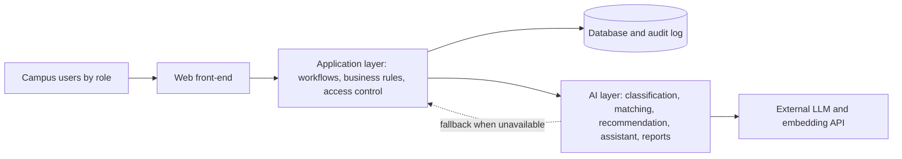

# Intelligent, AI-Powered Circular Campus Resource Exchange and Asset Life Cycle Management System

## Phase 3 – Requirements Document

**Khalifa University – Department of Computer Science**

**COSC 336 – Introduction to Software Engineering – Fall 2026**

**Prepared by:** Group 5 – Mohammed Alketbi (100067035), Abdulla, Mohammed Al Ali, Mubarak

**Prepared for:** Eng. Dina Atia, Lab Instructor

**Date:** October 2026

---

# 1. Introduction

## 1.1 Purpose

Phase 1 described the problem and Phase 2 showed that solving it is feasible. This document says exactly what the system shall do. It turns the ideas from the earlier phases into numbered, testable requirements that the design team can build against (Phases 4–5), the developers can implement (Phase 6) and the testers can verify (Phase 7). If a feature is not written here, it is not promised. If it is written here, it can be checked.

The document covers the whole prototype: the classic asset-management layer and the AI-enhanced layer.

## 1.2 Document Conventions

- **Identifiers.** Every item has a unique ID: `FR-<AREA>-nn` for functional requirements (for example `FR-AST-03` is the third asset-registration requirement), `NFR-nn` for non-functional requirements, `BR-nn` for business rules and `UC-nn` for use cases.
- **Wording.** "Shall" marks a mandatory requirement, "should" a desirable one and "may" an option.
- **Priority.** Every requirement is rated Essential (must be included in the prototype), Desirable (to be implemented if time permits) or Future (listed but not implemented). All priorities are described in Section 8.
- **Testable**: Each requirement describes exactly one testable thing. If a limit is relevant, it is stated numerically and not verbally (e.g., quickly).
- **Roles**: Roles are abbreviated in the permission matrix (Section 2.4). Definitions are provided in Appendix A.

  ## 1.3 Intended Audience and Reading Suggestions

| Reader | What they use this document for |
|---|---|
| Instructors (client) | To verify that the requirements are consistent with the project description and to evaluate the document |
| Developers | To design and implement features; every feature has listed requirements |
| Testers | To develop test cases in Phase 7; every requirement is formulated so that it can be verified |
| Project coordinator | To control the scope and priorities |

Sections 1–2 provide background and actors. Read Sections 4 (features), 5 (quality requirements) and Sections 7–8 about use cases and priorities.

## 1.4 Product Scope

The product is an internal web-based platform that enables registration of campus assets, publication of surplus, requests and reservations, approval and management of transfer, inspections, maintenance and tracking of each asset throughout its lifecycle. Semantic classification and matching, sustainability advice, natural language assistant and generation of reports is provided by an additional AI layer. The full scope of the product, both in-scope and out-of-scope functionalities, is described in Phase 1 (Section 3.7). Only the in-scope prototype is specified in this document.

## 1.5 References

1. Phase 1 – Initial Plan and Requirement Gathering Document, Group 5, 2026.
2. Phase 2 – Feasibility Document, Group 5, 2026.
3. COSC 336 Lab-based Running Project description, Fall 2026 (including the Software Requirements Specification template in its appendix).
4. COSC 336 Circular Campus Project slides, Fall 2026.
5. I. Sommerville, *Software Engineering*, Pearson.

# 2. Overall Description

## 2.1 Product Perspective

The software will be a new stand-alone product. It does not extend or interface to the existing university system, the authentication, departments and assets will exist only in the prototype (see Phase 2, Section 4.3). External dependencies are limited to AI service only.

AI layer is separated from the application layer. In case of unavailable service or low confidence of returned results, the application will fall back to simple keyword search and rules-based logic, and all the results of the AI layer are only recommendations for a human to accept or reject.

## 2.2 Product Functions

| Section | Feature | ID prefix | Layer |
|---|---|---|---|
| 4.1 | Asset registration and inventory | FR-AST | Classic |
| 4.2 | Resource publication (marketplace) | FR-MKT | Classic |
| 4.3 | Resource request submission | FR-REQ | Classic |
| 4.4 | Search and filtering | FR-SRC | Classic |
| 4.5 | Reservation and request management | FR-RSV | Classic |
| 4.6 | Approval workflows | FR-APR | Classic |
| 4.7 | Transfer management | FR-TRF | Classic |
| 4.8 | Inspection, maintenance and repair | FR-MNT | Classic |
| 4.9 | Life-cycle history | FR-HST | Classic |
| 4.10 | Donation, recycling and disposal | FR-DSP | Classic |
| 4.11 | User and access management | FR-USR | Classic |
| 4.12 | Notifications | FR-NTF | Classic |
| 4.13 | Operational reports | FR-RPT | Classic |
| 4.14 | Audit logging | FR-AUD | Classic |
| 4.15–4.19 | AI classification, matching and ranking, sustainable-action recommendation, LLM assistant, generative reporting | FR-AI | AI |
| 4.20 | Sustainability indicators | FR-SUS | AI / analytics |

## 2.3 Actors and Roles

| Role | Code | Who they are | Key responsibilities |
|---|---|---|---|
| Department Representative | DR | Represents the department and makes decisions about its needs and disposals | Makes requests, approves releases and transfers of the department, tracks the process |
| Asset Custodian | AC | The owner of the physical assets of a particular department, lab or store | Registers and manages the assets, publishes the surplus, transfers assets |
| Requester | RQ | Staff member in need of a resource for learning, research or working | Searches, requests, reserves and tracks requests |
| Administrator | AD | Administrative manager of the exchange | Manages workflow, approves high-impact actions, manages the accounts, reads reports |
| Procurement Officer | PO | In charge of purchases | Looks for alternative options inside the university before buying, reads the cost information |
| Finance Officer | FO | Evaluates the cost and savings information | Reviews the financial impact, co-approves the disposal of high value |
| Maintenance Staff | MS | Inspects and fixes assets | Reports defects, records inspections and fixes, manages the condition |
| Sustainability Officer | SO | Tracks the environmental effects | Reads the sustainability dashboard and reports |
| System Administrator | SA | Maintains the platform from technical side | Security, configurations, versions of the AI model and prompts, logs |

There are two secondary actors that participate too: the **AI Service**, which is the external LLM and embedding API used by the AI layer, and the **Notification Service**, which sends messages by e-mail and in-app.

## 2.4 Permission Matrix

Legend: **Y** = allowed, **D** = allowed for one’s own department/assigned items only, **-** = not allowed. Unauthenticated users are allowed to access the login page only.

**Table A – Assets, marketplace and requests**

| Action | DR | AC | RQ | AD | PO | FO | MS | SO | SA |
|---|---|---|---|---|---|---|---|---|---|
| View the listings published in the marketplace | Y | Y | Y | Y | Y | Y | Y | Y | - |
| View the full record of the asset | D | D | - | Y | - | - | D | - | - |
| View the financial information (purchase value, estimated value, costs) | D | D | - | Y | Y | Y | - | - | - |
| Register a new asset | D | D | - | Y | - | - | - | - | - |
| Edit the record and status of an asset | - | D | - | Y | - | - | - | - | - |
| Publish or withdraw a surplus listing | D | D | - | Y | - | - | - | - | - |
| Make or cancel a request for resources | D | - | D | - | - | - | - | - | - |
| Search and filter the listings | Y | Y | Y | Y | Y | Y | Y | Y | - |
| Reserve an available asset | D | - | D | - | - | - | - | - | - |
| Track the status of the request | D | - | D | Y | Y | - | - | - | - |
| View the AI recommendations of matching | D | D | D | Y | Y | - | - | - | - |
| Accept, edit or reject the AI classification of the asset | D | D | - | Y | - | - | - | - | - |

**Table B – Workflows, maintenance, reporting and administration**

| Action | DR | AC | RQ | AD | PO | FO | MS | SO | SA |
|---|---|---|---|---|---|---|---|---|---|
| Approve the asset release or reservation | D | - | - | Y | - | - | - | - | - |
| Approve a transfer | D | - | - | Y | - | - | - | - | - |
| Confirm the receipt of the transferred asset | D | D | - | Y | - | - | - | - | - |
| Approve donation or recycling | - | - | - | Y | - | - | - | - | - |
| Approve disposal | - | - | - | Y | - | Y | - | - | - |
| Report a defect or make a request for inspection | D | D | D | Y | - | - | D | - | - |
| Record an inspection and fixing actions | - | - | - | Y | - | - | D | - | - |
| View the history of maintenance actions | D | D | - | Y | - | Y | Y | Y | - |
| View the financial and savings reports | - | - | - | Y | Y | Y | - | Y | - |
| View the sustainability dashboard | D | - | - | Y | Y | Y | - | Y | - |
| Generate operational reports | D | D | - | Y | Y | Y | D | Y | - |
| Generate AI summary reports | - | - | - | Y | Y | Y | - | Y | - |
| Using the AI assistant within the scope of his/her permissions | Y | Y | Y | Y | Y | Y | Y | Y | - |
| Creating, editing or deactivating the accounts and assigning roles | - | - | - | Y | - | - | - | - | Y |
| Configuring the system settings, AI model and prompt versions | - | - | - | - | - | - | - | - | Y |
| View the audit log | - | - | - | Y | - | - | - | - | Y |

System Administrator doesn’t have routine access to the asset, request or financial data. This reduces the amount of the data accessible to the administrator having technical access (data minimisation). This permission matrix serves as the base while the real rules will be determined by the requirements in section 4.11.

